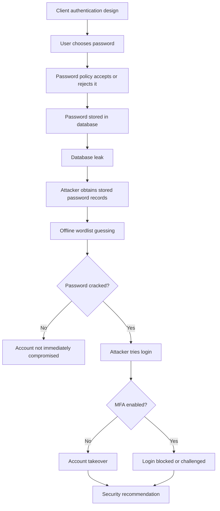

# Threat Model

## Client Scenario

The client is a fictional small web service with password-based authentication. The client currently believes their authentication system is reasonably secure because users must create complex-looking passwords.

Baseline configuration:

- Password policy: at least 8 characters, uppercase, lowercase, number, and symbol.
- Password storage: salted SHA-256.
- MFA: optional, not required for all users.
- Breached-password check: not implemented.

## Assets

- User accounts.
- Password database records.
- Session access after successful login.
- Account recovery and MFA reset flows.
- Client trust and service reputation.

## Attacker Model

The attacker:

- Has obtained a leaked copy of the password database.
- Can run offline guesses against password records.
- Has access to a candidate wordlist.
- Can attempt login with cracked credentials.

The attacker does not:

- Attack a real system in this project.
- Use real user credentials.
- Exploit browser, server, or network vulnerabilities outside the authentication flow.
- Run phishing against real users.

## Attack Chain

## Control Mapping

| Attack stage | Main risk | Control evaluated in this project | Metric |
|---|---|---|---|
| Password creation | Users choose predictable passwords | Complexity rule vs length/blocklist/layered policy | Weak-password rejection rate |
| Password storage | Leaked database exposes or enables cracking | Plaintext vs SHA-256 vs bcrypt vs Argon2id | Cracked accounts under time budget |
| Offline cracking | Attacker can test guesses cheaply | Slow/adaptive password hashing | Guesses per second, average verify time |
| Login after cracking | Known password becomes account access | MFA state | Account takeover with/without MFA |
| Recovery | Attacker bypasses primary controls | Secure recovery recommendation | Qualitative residual risk |

## Ethical Scope

This project uses synthetic users, synthetic passwords, and a local wordlist. It is a defensive demonstration designed to support security engineering analysis. No real service is attacked, and no real credentials are collected, tested, or stored.

## Assumptions and Limitations

- The wordlist is intentionally small so the demonstration is safe and understandable.
- The exact timing results depend on the machine running the experiment.
- The synthetic password set is designed to illustrate categories, not to represent all user behaviour.
- The dashboard models MFA as a binary control, while real MFA strength depends on the factor type, recovery process, and phishing resistance.
- The project does not evaluate session management, rate limiting, bot detection, or passkeys in depth.
